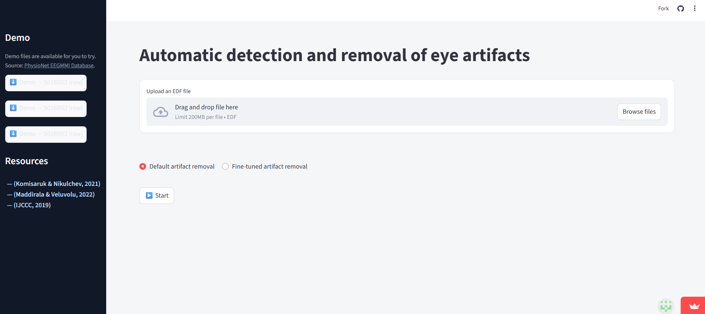

# EEG Eye-Blink Artifact Cleaner - in three steps only

1.Upload your EEG (.edf) 

2.Click Start 

3.Download your clean edf file. 

## About this tool
Eye-blink artifacts and articacts in general are common in EEG recordings and usually not relevant to brain studies.  
They usually need to be removed manually, which is time-consuming and requires experience.

This tool provides a simple and accessible solution:
- No need to code or preprocess manually.
- Just upload an `.edf` file, choose cleaning strictness, and get a cleaned version.
  
#Important limitation:
Please note that this tool is sutable (at the momment) mainly for **students or introductory use.

The current model is trained mainly on eye-blink activity from Fp1 and Fp2 channels. 

It is not yet trained on voluntary eye movement artifacts, other artifacts, muscle (EMG) noise, or environmental noise, but here is potential for gradual refinement of the model to cover additional artifact types so it can be equvelant to EEG lab and hopefully mach the proffisional need.

---

## Try it online-

**Web App:**  
https://eye-artifact-cleaner.streamlit.app/

## See app



---

## Run Locally (Optional)

If you want to run or modify the tool on your machine, follow:

```bash
# (Optional) Create a virtual environment
python -m venv .venv

# Activate it:
# Windows:
. .venv\Scripts\activate
# macOS / Linux:
source .venv/bin/activate

# Install dependencies
pip install -r requirements.txt

# Start the web app locally
streamlit run artifact_app.py

---
## requrements

streamlit>=1.32
mne>=1.5
scikit-learn>=1.3
numpy>=1.23
plotly>=5.15
edfio
 ---
##project structure

artifact_app.py              → Streamlit app (Upload → Clean → Download)
final_model.py               → Eye-blink detection + cleaning logic
best model.ipynb-colab.pdf   → Model development and reasoning notes


